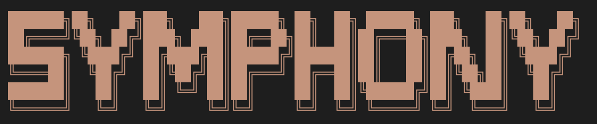
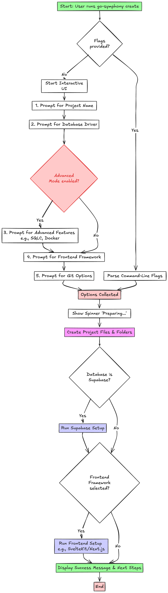

# go-symphony 🎵




Inspired by [go-blueprint](https://github.com/Melkeydev/go-blueprint), I aim to develop a modern CLI tool that generates Go web projects. go-symphony produces Go applications utilizing the Gin framework, PostgreSQL database, and SQLC for type-safe queries. My motivation stems from exclusively employing Gin as an API server and PostgreSQL as my database, eliminating the need for alternative options. Having recently adopted Supabase extensively, I intend to integrate its capabilities into this project. Finally, as I use SvelteKit or Next.js to build the front-end, so I incorporate it into go-symphony. 
## 📺 Demo

Check out a video walkthrough of go-symphony in action: [YouTube Demo](https://www.youtube.com/watch?v=djzhFAd4rjg)
## ✨ Features

- **🚀 Modern Go Architecture**: Clean project structure with best practices built-in
- **🌐 Gin Framework**: High-performance HTTP web framework with httprouter
- **🗄️ PostgreSQL Support**: PostgreSQL with pgx driver for optimal performance
- **🔒 Type-Safe Queries**: SQLC integration for compile-time SQL validation
- **☁️ Supabase Integration**: Modern backend-as-a-service with auth and real-time features
- **🐳 Docker Ready**: Optional Docker and docker-compose configuration
- **⚡ Hot Reload**: Air integration for development with live reload
- **🧪 Testing Setup**: Pre-configured testing with testcontainers
- **🔄 CI/CD**: GitHub Actions workflows for testing and releasing
- **🌐 Frontend Integration**: Optional SvelteKit and Next.js frontend generation
- **🔌 WebSocket Support**: Real-time communication capabilities

## 🎯 Project Structure

Go Symphony generates projects with this consistent structure:

```
your-project/
├── cmd/api/main.go           # Application entry point
├── internal/
│   ├── server/               # Gin server and routes
│   ├── database/             # Database service layer
│   └── db_sqlc/              # SQLC generated code (optional)
├── sqlc/                     # Standard PostgreSQL setup
│   ├── migrations/           # SQL schema files
│   └── queries/              # SQL query files
├── supabase/                 # Supabase setup (alternative)
│   └── migrations/           # Supabase migration files
├── Makefile                  # Build and development commands
├── .env                      # Environment configuration
├── .air.toml                 # Hot reload configuration
└── docker-compose.yml       # Database containers (non-Supabase)
```

## 📦 Installation

### Option 1: Install with Go (Recommended)

```bash
go install github.com/Tomlord1122/go-symphony@latest
```

### Option 2: Install from Releases

Download the latest release from [GitHub Releases](https://github.com/Tomlord1122/go-symphony/releases):

### Option 3: Build from Source

```bash
git clone https://github.com/Tomlord1122/go-symphony.git
cd go-symphony
go build -o go-symphony .
sudo mv go-symphony /usr/local/bin/
```

## 🚀 Quick Start

### Create a New Project

```bash
# Interactive mode (recommended for first use)
go-symphony create
```

### Basic Usage

```bash

# Create project with advanced features
go-symphony create -a

# Create project with name my-api
go-symphony create -n my-api 

# Create project with name my-api and advanced features
go-symphony create -n my-api -a

```

### Available Options

- **Database Drivers**: `postgres`, `supabase`, `none`
- **Advanced Features**: `sqlc`, `docker`, `githubaction`, `websocket`
- **Frontend Framework**: `sveltekit`, `nextjs`, `none`
- **Git Options**: `commit`, `stage`, `skip`

## 🛠️ Development Workflow

After creating your project:

```bash
cd your-project

# Start PostgreSQL database (if using postgres driver)
make docker-run

# Generate SQLC code (if using SQLC)
make sqlc-generate

# Start development server with hot reload
make watch

# Run tests
make test

# Build for production
make build
```

## 📋 Prerequisites

### Required
- **Go 1.24+**: [Download Go](https://golang.org/dl/)
- **Git**: For project initialization

### Optional (for specific features)
- **Docker**: For database containers and containerization
- **Supabase CLI**: For Supabase integration - [Install Supabase CLI](https://supabase.com/docs/guides/cli)
- **Node.js & pnpm**: For SvelteKit frontend - [Install Node.js](https://nodejs.org/) & [Install pnpm](https://pnpm.io/installation)
- **SQLC**: Automatically installed via Makefile when needed

### Create Command

```bash
go-symphony create [flags]
```

**Flags:**
- `-n, --name string`: Name of project to create
- `-a, --advanced`: Enable advanced features prompt

### Version Command

```bash
go-symphony version
```

### workflow



## 🤝 Contributing

We welcome contributions! Please see our contributing guidelines:

1. Fork the repository
2. Create a feature branch (`git checkout -b feature/amazing-feature`)
3. Commit your changes (`git commit -m 'Add amazing feature'`)
4. Push to the branch (`git push origin feature/amazing-feature`)
5. Open a Pull Request

## 📝 License

This project is licensed under the MIT License - see the [LICENSE](LICENSE) file for details.

## 🙏 Acknowledgments
- Inspired and referenced by [go-blueprint](https://github.com/Melkeydev/go-blueprint)
- Built with [Cobra CLI](https://github.com/spf13/cobra) and [Bubble Tea](https://github.com/charmbracelet/bubbletea)
- Claude CLI-inspired color scheme and user experience